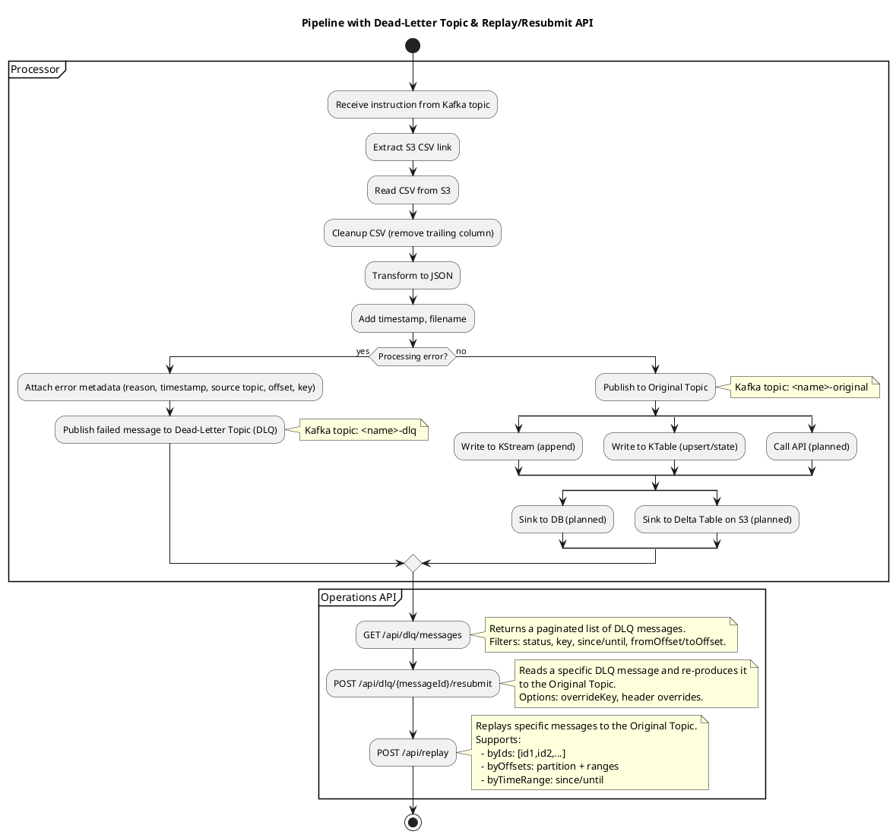

## The plantuml source

```plantuml
@startuml
title Pipeline with Dead-Letter Topic & Replay/Resubmit API

start

partition "Processor" {
  :Receive instruction from Kafka topic;
  :Extract S3 CSV link;
  :Read CSV from S3;
  :Cleanup CSV (remove trailing column);
  :Transform to JSON;
  :Add timestamp, filename;

  if (Processing error?) then (yes)
    :Attach error metadata (reason, timestamp, source topic, offset, key);
    :Publish failed message to Dead-Letter Topic (DLQ);
    note right
      Kafka topic: <name>-dlq
    end note
  else (no)
    :Publish to Original Topic;
    note right
      Kafka topic: <name>-original
    end note

    split
      :Write to KStream (append);
    split again
      :Write to KTable (upsert/state);
    split again
      :Call API (planned);
    end split

    split
      :Sink to DB (planned);
    split again
      :Sink to Delta Table on S3 (planned);
    end split
  endif
}

partition "Operations API" {
  :GET /api/dlq/messages;
  note right
    Returns a paginated list of DLQ messages.
    Filters: status, key, since/until, fromOffset/toOffset.
  end note

  :POST /api/dlq/{messageId}/resubmit;
  note right
    Reads a specific DLQ message and re-produces it
    to the Original Topic.
    Options: overrideKey, header overrides.
  end note

  :POST /api/replay;
  note right
    Replays specific messages to the Original Topic.
    Supports:
      - byIds: [id1,id2,...]
      - byOffsets: partition + ranges
      - byTimeRange: since/until
  end note
}

stop
@enduml

```